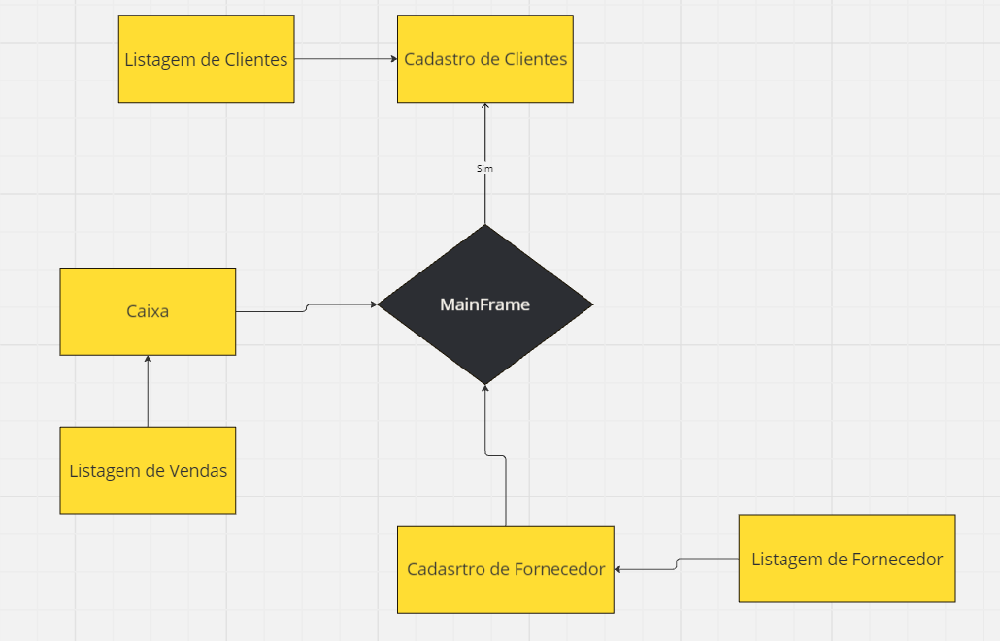

# SalaoJava

# Escopo do Projeto: Sistema de Caixa para Salão de Beleza

## 1. Objetivo do Projeto
Desenvolver um sistema de caixa para um salão de beleza, utilizando **Java Maven** e **JDBC** para a integração com banco de dados e **Java Swing** para a interface gráfica. O sistema deve gerenciar vendas, estoque de produtos, cadastro de clientes e fornecedores, além de permitir o registro de itens vendidos, mantendo todas as transações organizadas.

## 2. Funcionalidades Principais

- **Sistema de Caixa:**
  - Registro de vendas com cálculo automático do total da compra.
  - Integração de clientes às vendas para histórico de compras.
  - Suporte a múltiplas formas de pagamento (cartão, dinheiro, etc.).
  - Registro de produtos vendidos e quantidades.

- **Gerenciamento de Estoque:**
  - Cadastro de produtos com preço, quantidade e fornecedor.
  - Controle de estoque com registro de baixas automáticas conforme as vendas são realizadas.
  - Listagem e atualização de produtos.

- **Cadastro de Clientes e Fornecedores:**
  - Cadastro de novos clientes com nome, contato e informações relevantes.
  - Cadastro de fornecedores para facilitar a reposição de estoque.
  - Atualização e exclusão de clientes e fornecedores conforme necessário.

- **Relatórios e Consultas:**
  - Consulta de vendas por data, cliente ou produto.
  - Listagem de todas as vendas realizadas no dia.
  - Relatórios de produtos em estoque e baixo estoque.
  - Histórico de compras por cliente.

## 3. Tecnologias Utilizadas

- **Linguagem:** Java
- **Frameworks:** Maven para gerenciamento de dependências e organização do projeto.
- **Interface Gráfica:** Java Swing com componentes como `JTabbedPane` para gerenciamento de múltiplas abas (Clientes, Fornecedores, Produtos, Vendas).
- **Banco de Dados:** JDBC para conexão com o banco de dados, onde será gerenciado o armazenamento de clientes, fornecedores, produtos e vendas.
- **Padrão de Projeto:** DAO (Data Access Object) para facilitar o acesso e manipulação dos dados no banco.
- **Pacotes:** Estrutura de pacotes dividida por funções como `model`, `dao`, `service`, e `view` para garantir a organização e manutenibilidade do código.

## 4. Estrutura de Classes

- **Cliente:** `id`, `nome`, `telefone`, `email`
- **Fornecedor:** `id`, `nome`, `produto_fornecido`, `contato`
- **Produto:** `id`, `nome`, `preço`, `quantidade`, `fornecedor`
- **Venda:** `id`, `data`, `total`, `formaPagamento`, `clienteId`
- **VendaDAO:** Métodos de CRUD para vendas e itens de venda.
- **ProdutoDAO:** Métodos para gerenciar o estoque e produtos.

## 5. Cronograma

| Fase                    | Descrição                                                                 | Tempo Estimado |
|-------------------------|---------------------------------------------------------------------------|----------------|
| **1. Análise de Requisitos** | Levantamento de requisitos, análise funcional do sistema.                  | 1 semana       |
| **2. Design do Sistema**     | Estruturação da interface gráfica e dos modelos de dados.                 | 1 semana       |
| **3. Implementação do CRUD** | Implementação do cadastro e gerenciamento de Clientes, Fornecedores, Produtos. | 2 semanas      |
| **4. Sistema de Vendas**     | Desenvolvimento das funcionalidades de vendas e baixa de produtos no estoque. | 3 semanas      |
| **5. Relatórios e Consultas**| Implementação das consultas e geração de relatórios de vendas e estoque.    | 1 semana       |
| **6. Testes e Validação**    | Testes do sistema para garantir o funcionamento correto das funcionalidades. | 1 semana       |

## 6. Riscos

- **Erros na integração com o banco de dados:** O uso de JDBC requer atenção ao manipular conexões e consultas SQL.
- **Interface amigável:** Desafios na criação de uma interface gráfica intuitiva e responsiva.
- **Gestão de estoque:** Garantir que o controle de estoque funcione corretamente com a baixa automática ao registrar vendas.
  
## 7. Recursos Necessários

- **Desenvolvedores:** 1-2 desenvolvedores com experiência em Java e JDBC.
- **Ferramentas:** IDE (IntelliJ ou Eclipse), MySQL/PostgreSQL para banco de dados.
- **Bibliotecas:** Maven, bibliotecas Java Swing para interface gráfica.

## 8. Conclusão

O projeto visa entregar um sistema completo e eficiente para gerenciamento de vendas e estoque de um salão de beleza. A solução deve ser capaz de fornecer uma visão geral dos produtos, vendas diárias e histórico de clientes, facilitando a organização e eficiência do negócio.

# Manual do Usuário: Sistema de Caixa para Salão de Beleza

## 1. Introdução
Este manual foi criado para auxiliar o usuário na utilização do sistema de caixa para salão de beleza, que foi desenvolvido para registrar vendas, gerenciar estoque, cadastrar clientes e fornecedores, e facilitar a administração geral do salão.

## 2. Acesso ao Sistema

### 2.1 Abrindo o Sistema
- Ao iniciar o sistema, uma janela principal será exibida com várias abas organizadas em um **JTabbedPane**:
  - **Clientes**
  - **Fornecedores**
  - **Produtos**
  - **Vendas**

Cada aba possui funcionalidades específicas para cadastro, listagem e gerenciamento.

## 3. Cadastro de Clientes

### 3.1 Como cadastrar um cliente:
1. Clique na aba **Clientes**.
2. Preencha os campos de **Nome**, **Telefone**, e **E-mail**.
3. Clique no botão **Salvar** para registrar o cliente.

### 3.2 Como visualizar e editar clientes:
1. Na aba **Clientes**, clique no botão **Listar Clientes**.
2. Uma lista de todos os clientes será exibida.
3. Para editar um cliente, selecione o cliente na lista, modifique as informações desejadas e clique em **Salvar Alterações**.

### 3.3 Como excluir um cliente:
1. Na aba **Clientes**, selecione o cliente que deseja excluir.
2. Clique no botão **Excluir**.

## 4. Cadastro de Fornecedores

### 4.1 Como cadastrar um fornecedor:
1. Navegue até a aba **Fornecedores**.
2. Preencha os campos de **Nome**, **Produto Fornecido**, e **Contato**.
3. Clique em **Salvar** para adicionar o fornecedor ao sistema.

### 4.2 Como visualizar, editar e excluir fornecedores:
- As funcionalidades são semelhantes às descritas na seção de clientes:
  - Para **visualizar**: clique em **Listar Fornecedores**.
  - Para **editar**: selecione um fornecedor, edite as informações e clique em **Salvar Alterações**.
  - Para **excluir**: selecione o fornecedor e clique em **Excluir**.

## 5. Gerenciamento de Produtos

### 5.1 Como cadastrar um produto:
1. Acesse a aba **Produtos**.
2. Preencha os campos **Nome**, **Preço**, **Quantidade**, e selecione o **Fornecedor**.
3. Clique em **Salvar** para adicionar o produto ao estoque.

### 5.2 Como visualizar e editar produtos:
1. Na aba **Produtos**, clique em **Listar Produtos**.
2. Para editar, selecione o produto, faça as modificações desejadas e clique em **Salvar Alterações**.

### 5.3 Como excluir um produto:
1. Selecione o produto que deseja remover.
2. Clique em **Excluir**.

### 5.4 Controle de estoque:
- O sistema ajusta automaticamente a quantidade em estoque de cada produto à medida que as vendas são registradas. O estoque é atualizado conforme as vendas são realizadas.

## 6. Registro de Vendas

### 6.1 Como registrar uma venda:
1. Acesse a aba **Vendas**.
2. Selecione o **Cliente** que está realizando a compra.
3. Adicione os **Produtos** comprados e suas respectivas quantidades.
4. O **Total** será calculado automaticamente com base nos produtos selecionados.
5. Escolha a **Forma de Pagamento** (cartão, dinheiro, etc.).
6. Clique em **Registrar Venda** para finalizar o processo.

### 6.2 Como visualizar vendas realizadas:
1. Na aba **Vendas**, clique em **Listar Vendas**.
2. As vendas serão exibidas com informações detalhadas, incluindo data, cliente, produtos e valor total.

## 7. Relatórios e Consultas

### 7.1 Consultar vendas do dia:
1. Na aba **Vendas**, você pode utilizar o filtro de data para visualizar todas as vendas registradas em um determinado dia.
2. Selecione a data desejada e clique em **Buscar Vendas**.

### 7.2 Relatório de estoque:
1. Na aba **Produtos**, clique em **Relatório de Estoque** para visualizar a quantidade de cada produto disponível no salão.
2. Produtos com baixa quantidade serão destacados para facilitar a reposição.

## 8. Atualização e Exclusão de Vendas

### 8.1 Como atualizar uma venda:
1. Na aba **Vendas**, selecione a venda que deseja modificar.
2. Atualize os dados necessários (cliente, produtos ou forma de pagamento).
3. Clique em **Salvar Alterações** para registrar as modificações.

### 8.2 Como excluir uma venda:
1. Na lista de vendas, selecione a venda que deseja excluir.
2. Clique em **Excluir** para remover a venda do sistema.

## 9. Considerações Finais

Este sistema foi desenvolvido para proporcionar uma gestão simples e eficiente das operações do salão de beleza. Certifique-se de manter o cadastro de produtos e o estoque sempre atualizados para que o sistema possa fornecer informações precisas. Caso tenha dúvidas ou encontre problemas, consulte o suporte técnico ou o administrador do sistema.

## Diagrama de Classe

## Diagrama de Fluxo

